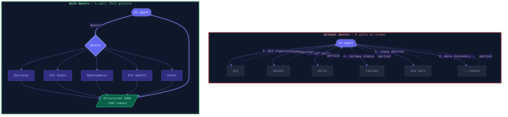
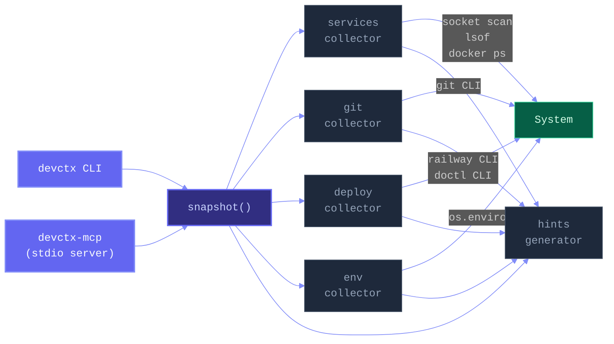

# devctx

**One command. Full project context. For AI agents.**

Stop your agents from burning tokens on discovery. `devctx` gives Claude Code, Hermes, and any AI agent a structured snapshot of your entire dev environment in a single call.

```bash
$ devctx
```

```json
{
  "services": {
    "hermes-gateway": { "port": 8642, "status": "listening", "pid": 4821 },
    "postgres-alt": { "port": 5433, "status": "listening" },
    "redis/dragonfly": { "port": 6379, "status": "listening" }
  },
  "git": {
    "hermes-agent": { "branch": "improve/cycle-13", "dirty": false, "ahead": 2 },
    "my-app": { "branch": "main", "dirty": true, "changed_files": 3 }
  },
  "deploy": {
    "railway": { "projects": [{ "name": "my-api", "id": "abc123" }] }
  },
  "env": {
    "set": ["ANTHROPIC_API_KEY", "GITHUB_TOKEN"],
    "missing": ["OPENAI_API_KEY"]
  },
  "hints": [
    "hermes-agent has 2 unpushed commit(s) on improve/cycle-13",
    "my-app has 3 uncommitted change(s)",
    "missing env vars: OPENAI_API_KEY"
  ]
}
```

---

## Why

AI agents waste tokens discovering your environment through trial and error — checking ports, running `git status` on every repo, probing for services, retrying when something's down. Each discovery call re-sends the full conversation history.

**devctx eliminates the discovery phase entirely.**



### The math

| | Without devctx | With devctx |
|---|---|---|
| **Tool calls to orient** | 5-15 | 1 |
| **Tokens on discovery** | 2,000-8,000+ | ~500 |
| **Retry loops from missing context** | Common | Eliminated |
| **Works across agents** | Manual per-agent | Universal |

---

## Install

```bash
pip install devctx
```

Or install from source:

```bash
git clone https://github.com/DevvGwardo/devctx.git
cd devctx
pip install .
```

---

## Usage

### CLI

```bash
# Full snapshot (default)
devctx

# Specific sections
devctx --services          # Running services & ports
devctx --git               # Git state across repos
devctx --deploy            # Railway, DigitalOcean status
devctx --env               # Environment variable health
devctx --hints             # Agent-friendly hints only

# Options
devctx --scan-dir ~/projects --scan-dir ~/work   # Custom scan directories
devctx --check-env MY_CUSTOM_VAR                  # Check additional env vars
devctx --compact                                  # Minified JSON output
```

### MCP Server (for Hermes, Claude Code, etc.)

`devctx` ships with a built-in MCP server so any MCP-compatible agent can call it as a tool.

**Add to Claude Code:**

```bash
claude mcp add devctx -- devctx-mcp
```

**Add to Hermes (`~/.hermes/config.yaml`):**

```yaml
mcp_servers:
  devctx:
    command: devctx-mcp
```

The MCP server exposes a single tool — `get_dev_context` — that returns the same structured JSON as the CLI.

**Note:** MCP subprocesses don't inherit interactive-shell environment variables. To ensure API keys and other secrets appear in the `env` section, put your exports in `~/.zshenv` (not `~/.zshrc`), or on macOS use `launchctl setenv VAR value` to persist them across login and non-login shells.

### In agent prompts

Add to your `CLAUDE.md` or agent system prompt:

```
At the start of every task, run `devctx` to understand the current environment.
Use the `hints` field to inform your approach before writing any code.
```

---

## Architecture



### Collectors

| Collector | What it checks | How |
|---|---|---|
| **services** | Running services on known ports, Docker containers | Socket probing, `lsof`, `docker ps` |
| **git** | Branch, dirty state, ahead/behind, last commit | `git` CLI across scanned directories |
| **deploy** | Railway projects, DigitalOcean droplets | Config files + CLI tools |
| **env** | Presence of expected environment variables | `os.environ` (values never exposed) |
| **hints** | Agent-actionable insights from all of the above | Aggregation + heuristics |

### Adding collectors

Drop a new file in `devctx/collectors/`, implement a `collect_*()` function that returns a dict, and wire it into `cli.py:snapshot()`. That's it.

---

## Principles

Inspired by [InsForge's context engineering approach](https://github.com/InsForge/InsForge):

1. **One call, full picture** — No sequential discovery. The agent gets everything it needs in ~500 tokens.
2. **Structured output** — JSON that agents can parse, not free text that needs interpretation.
3. **Hints, not just data** — The `hints` field tells the agent what to *do*, not just what *is*.
4. **Security by default** — Environment variables report presence only, never values. No secrets in output.
5. **Agent-agnostic** — Works with Claude Code, Hermes, any MCP client, or plain `bash`.

---

## License

MIT
